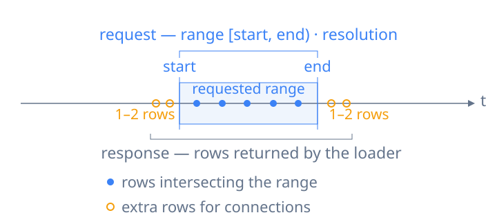

# Loading and Updating Data

Extend [Drawing a Chart](/guide/drawing-a-chart) with remote loading and live updates, using the [DataSource and DataLoader model](/guide/concepts#dataloader-and-datasource).

The examples use a target sized with CSS:

```html
<div id="chart" style="height: 240px"></div>
```

Choose acquisition based on what your application can supply:

| Available data         | Input                                             |
| ---------------------- | ------------------------------------------------- |
| Complete dataset       | Inline rows, a snapshot URL, or a snapshot loader |
| Requested history only | A templated URL or a range loader                 |

Both can serve the display's chunk queries: snapshot loading and chunk loading are not mutually exclusive.

## Snapshot Loading

### Load inline data

Snapshots remain loaded until invalidation. Drawing a Chart passes an array directly; use `createDataSource()` when you need an instance for invalidation or reuse, then register it in `sources`:

```ts
import { createDataSource, Timescope } from 'timescope';

const measurements = createDataSource([
  { time: 0, value: 18 },
  { time: 15, value: 21 },
  { time: 30, value: 19 },
]);

const timescope = new Timescope({
  target: '#chart',
  fit: [0, 30],
  sources: { measurements },
  series: { temperature: { data: { source: 'measurements' }, chart: 'lines' } },
});
```

### Load from a URL

A URL without placeholders loads a complete snapshot. It can return a JSON array in the same row format:

```ts
const measurements = createDataSource({ url: '/samples.json' });
```

### Load with a snapshot loader

Use a `loader` callback for application logic such as authentication or an SDK call. A **snapshot loader** takes no arguments and returns the complete dataset; set `chunked: false`:

```ts
const measurements = createDataSource({
  chunked: false,
  loader: async () => {
    const response = await fetch('/samples.json');
    if (!response.ok) throw new Error(`Samples: ${response.status}`);
    return response.json();
  },
});
```

### Convert a response to rows

If an endpoint returns a different structure, use `decoder` to convert its response to rows. For field-path mapping without a callback, use [`mappings`](/api/timescope-options#mappings). These transforms also apply to range loading.

```ts
const measurements = createDataSource({
  url: '/api/measurements',
  decoder: async (response: Response) => {
    if (!response.ok) throw new Error(`Measurements: ${response.status}`);
    const payload = await response.json();
    return payload.samples.map((sample: { timestamp: string; temperature: number }) => ({
      time: sample.timestamp,
      value: sample.temperature,
    }));
  },
});
```

## Chunk Loading

The Series' `data.resolution` and the DataSource's resolution hints select the [data resolution](/api/timescope-options#resolution). By default, the preferred interval is the display resolution from [Core Concepts](/guide/concepts#time-and-zoom).

Each display query covers a chunk of width **`chunkSize × data resolution`**, anchored to **`chunkOrigin`**. Chunks overlapping the visible range are queried with their full ranges. Results are cached per DataSource and shared across Series using that instance.


`chunkSize` defaults to `256`, and `chunkOrigin` to `0`. Snapshots answer locally; the following range-loading inputs acquire only the requested history.

### Load from a templated URL

Include range placeholders so the endpoint can return rows for the requested time range and resolution:

```ts
const history = createDataSource({
  url: '/api/history?start={start}&end={end}&resolution={resolution}',
});
```

Timescope substitutes the placeholders as the user pans and zooms. The endpoint should follow the [range response requirements](#return-rows-for-a-range) below.

[URL placeholders](/api/timescope-options#url-placeholders)

### Load with a range loader

A **range loader** receives the requested range and data resolution. Function loaders use this mode by default (`chunked: true`):

```ts
import { createDataSource } from 'timescope';

const history = createDataSource({
  loader: async ({ range: [start, end], resolution }) => {
    const query = new URLSearchParams({
      start: start.toString(),
      end: end.toString(),
      resolution: resolution.toString(),
    });
    const response = await fetch(`/api/history?${query}`);
    if (!response.ok) throw new Error(`History: ${response.status}`);
    return response.json(); // Rows at the requested resolution, including link neighbors.
  },
});
```

### Return rows for a range

Templated URLs and range loaders use the same response contract. Return complete rows intersecting the request, with neighboring points where available to continue Links across chunk boundaries.



| Request / response         | Contract                                                                        |
| -------------------------- | ------------------------------------------------------------------------------- |
| Request                    | Finite `[start, end)` with `start <= end`, positive `resolution`; all `Decimal` |
| Chunk boundaries           | No alignment requirement; the same loader can serve direct range queries        |
| Points                     | `start <= time < end`                                                           |
| Intervals                  | All intersecting rows, without trimming their times                             |
| Recommended Link neighbors | One on each side for lines/steps; two for curves, including empty ranges        |

[Loading options](/api/timescope-options#source-options) · [Resolution](/api/timescope-options#resolution) · [Dynamic Loader example](/guide/examples/#dynamic-loader)

## Refresh changed data

Invalidate a DataSource when previously loaded data has changed. Use a range for corrected history or newly available samples at the live tail; replacement data is loaded on demand.

| Change              | Call                                       |
| ------------------- | ------------------------------------------ |
| Complete snapshot   | `measurements.invalidate()`                |
| Historical interval | `history.invalidate([120, 180])`           |
| Live tail           | `history.invalidate([180, undefined])`     |
| All DataSources     | `await timescope.reload()`                 |
| Named DataSources   | `await timescope.reload(['measurements'])` |

Include late-arriving samples in the invalidated range. A snapshot is reacquired as a whole, even if you pass a range. Input-array mutations are not observed until invalidation.

Neither `invalidate()` nor `await reload()` waits for replacement data and drawing. Before export, [wait for data and drawing](/guide/advanced/views#wait-for-data-and-drawing).

## Append live points

For an ordered live stream, use `type: 'point-aggregate'` and call `append()` as points arrive. Appending does not move the view; advance the [playback clock](/guide/advanced/views#follow-a-live-or-playback-clock) separately to follow the latest sample.

```ts
import { createDataSource, Timescope } from 'timescope';

const signal = createDataSource({
  type: 'point-aggregate',
  data: [{ time: 0, value: 1 }],
});

const timescope = new Timescope({
  target: '#chart',
  time: null,
  zoom: 5,
  sources: { signal },
  series: { signal: { data: { source: 'signal' }, chart: 'lines' } },
  tracks: { default: { timeAxis: { relative: true } } },
});
timescope.setPlaybackTime(0);

await signal.append([
  { time: 1, value: 2 },
  { time: 2, value: 1.5 },
]);
timescope.setPlaybackTime(2);
```

| Requirement          | Rule                                                                        |
| -------------------- | --------------------------------------------------------------------------- |
| Input                | Nondecreasing times across initial and appended points; equal times allowed |
| Chart refresh        | Automatic after `append()`                                                  |
| Promise completion   | Data updated; drawing may still be pending                                  |
| Snapshot replacement | `invalidate()` discards appends absent from the original input              |

[Appending Points](/api/timescope-options#appending-points) · [Live Stream example](/guide/examples/#live-stream)

## Reuse a DataSource {#reuse-a-source}

When replacing configuration, keep the same DataSource instance to retain loaded data. This also applies to [framework `options` updates](/guide/advanced/frameworks#configuration-and-state): do not recreate the DataSource for an appearance-only change.

```ts
timescope.setOptions({
  sources: { measurements },
  series: { temperature: { data: { source: 'measurements' }, chart: 'lines:filled' } },
});
```

[DataSource lifecycle](/api/timescope-options#invalidation-and-caching) · [Reusable DataLoader](/api/timescope-options#reusable-dataloader)
