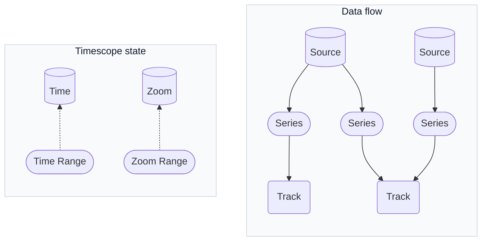
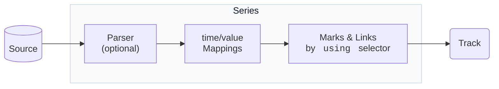

# Core Concepts

Timescope provides time navigation and time-series visualization capabilities.

- Infinite zooming and scrolling using [`Decimal`](https://www.npmjs.com/package/@kikuchan/decimal) for arbitrary-precision arithmetic
- Time-series data visualization with configurable marks and links
- Chunk-based data loading based on viewport and zoom level
- Declarative configuration for visual rendering and interaction behavior



## Timescope state

- `time` — Cursor position. `null` follows current time.
- `zoom` — Logarithmic zoom level (higher = more detail)
```TypeScript
time: new Date(),
zoom: 3,
```

>[!NOTE]
> Timescope accepts any scalar unit (seconds, samples, frames). Values are converted to `Decimal` internally for precise arithmetic. The default `timeAxis` assumes seconds. When using custom units, configure the axis formatter accordingly and ensure consistency across loader outputs, `setTime()` calls, and selection ranges.

### Time Range

Control navigable time bounds.

```TypeScript
timeRange: [min, max],
```

- `null` means "now".
- `undefined` means unbounded.
- `[undefined, 100]` — From negative infinity to 100.
- `[0, undefined]` — From 0 to positive infinity.
- `[null, null]` — Locked to current time.

### Zoom Range

Constrain zoom levels.

```TypeScript
zoomRange: [min, max],
```

- `undefined` means unbounded.
- `[0, 10]` — Limit zoom between 0 and 10.
- `[undefined, 5]` — No minimum, maximum 5.


## Data Sources

Data source can be provided in multiple ways:
- Simple plain object
- URL string for JSON
- Custom loader function for chunk-loading

```TypeScript
sources: {
  telemetry: {
    loader: async (chunk, api) => {
      api.expiresIn(60_000);
      const start = chunk.range[0]?.number() ?? 0;
      const end = chunk.range[1]?.number() ?? start + 60;
      return fetch(`/api?start=${start}&end=${end}`).then((r) => r.json());
    },
    chunkSize: 256,
  },
  snapshot: { url: '/api/snapshot.json' },
  inline: [
    { startedAt: 0, value: 22 },
    { startedAt: 60, value: 25 },
  ],
}
```

## Series

Map source data to visual marks and links. Each series follows this flow:



- **Parser** — (optional) reshapes the raw source but must return an array of plain objects.
- **Mappings** — describe how parsed object expose timestamps and numeric metrics.
- **Marks** — symbols for each data point.
- **Links** — connections between data points.

```TypeScript
series: {
  temperature: {
    data: {
      source: 'telemetry',
      time: ['time'],
      value: ['min', 'value', 'max'],
    },
    chart: {
      marks: [{ draw: 'circle' }],
      links: [{ draw: 'area', using: ['min', 'max'] }],
    },
  },
}
```

### `using` selectors

`using` strings pick which data fields to draw:

```
'valueKey@timeKey'
```

- `valueKey` — Which `value` field to use (defaults to `'value'`).
- `timeKey` — Which `time` field to use (defaults to `'time'`).
- `'@start'` is shorthand for `'value@start'`.

Use tuples like `['value@start', 'value@end']` when a primitive needs two coordinates. The special key `'zero'` references the axis.

## Tracks

Organize series into vertical sections.

```TypeScript
tracks: {
  overview: { timeAxis: false },
  detail: {
    timeAxis: {
      labels: { color: '#94a3b8', fontSize: '12px' },
      timeFormat: ({ time }) => new Date(time.mul(1000).number()).toLocaleTimeString(),
    },
  },
}
```
