# Core Concepts

Timescope is not only a time picker, but also a visualizer for time-series data. You can use its navigation on its own, or build Charts that reveal data across widely different time scales.

Three concepts shape what you can build:

- **[Infinite by design](#infinite-by-design)** — navigate broad ranges and fine detail without a fixed time range or precision.
- **[Chunk loading](#chunk-loading)** — explore a history without loading all of it at once.
- **[Independent Marks and Links](#independent-marks-and-links)** — compose shapes and connections to express your data.

The rest of this page explains those ideas and the DataSources, Series, Tracks, and Domains that turn them into a visualization. For configurations you can use directly, see [Drawing a Chart](/guide/drawing-a-chart).

## Infinite by design

An overview of a long history and a close-up of a brief event use the same navigation model. Timescope represents time, values, and resolutions with [Decimal](/api/classes#decimal), preserving precision across widely different scales rather than imposing a fixed calendar span or numeric precision.

### Time, zoom, and resolution {#time-and-zoom}

**Time** is the selected time, marked by the time cursor at the center of the view. **Display resolution** is the time span per pixel. Together they determine the visible time range.

**Zoom level** is a logarithmic expression of display resolution:

$$
\mathit{resolution} = 2^{-\mathit{zoom}}
$$

At zoom `0`, one pixel spans one time unit. Increasing zoom by one halves the display resolution and the visible time span.

`time = null` follows the clock (the wall clock by default); the property remains `null`, not the current timestamp. `timeRange` bounds navigation, and `zoomRange` bounds the zoom level.

## Chunk loading

Exploring a large history should not require downloading every sample first. Timescope can request data for the time range being viewed, at a resolution appropriate for the current zoom. Panning brings new ranges into view; zooming in asks for finer detail.

**Display resolution** describes time per pixel. **Data resolution** describes the desired interval of the data. They are related, but need not be equal: a broad overview can use summaries while a close-up uses individual samples.

Requests are grouped into chunks so data can be reused as the view moves. Your application supplies data for the requested ranges and resolution; it does not need to load the entire history or issue requests on every navigation event.

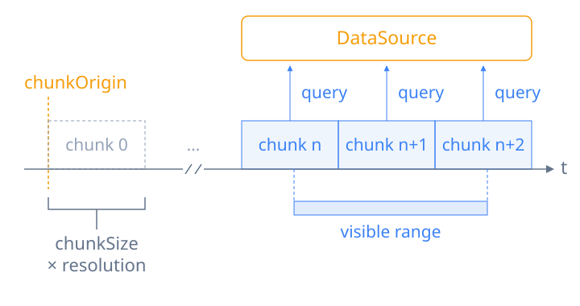

[Chunk Loading](/guide/advanced/chunk-loading) shows how to connect a URL or loader. For data already available as a complete snapshot, [decimation](/guide/drawing-a-chart#decimation) provides resolution-dependent summaries locally.

## Independent Marks and Links

**Marks** draw individual rows. **Links** connect consecutive rows. They are independent: a Chart can draw either, or combine several of each. A line with points, a min/max ribbon, and a set of interval annotations are compositions of these same parts.

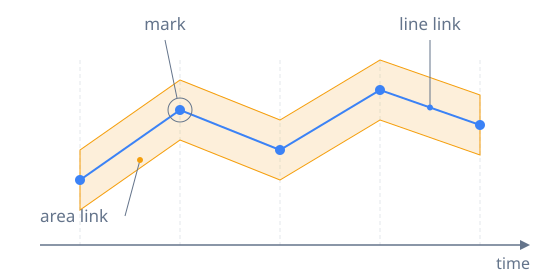

[Chart presets](/api/types#timescopecharttype) provide ready-made combinations. When a preset is not enough, choose the Marks and Links yourself and bind each to the fields it needs. The data can stay the same while its visual expression changes.

[Styling](/guide/advanced/styling#marks-and-links) shows how to build those combinations.

## Putting a visualization together

A **DataSource** supplies rows. A **Series** associates those rows with a value scale and presentation settings. Its **Chart** draws Marks and Links in a **Track**, using a **Domain** to map values to vertical positions. These parts can be shared independently: sharing data does not require sharing a value scale, and sharing a scale does not require drawing on the same Track.

### DataSources {#sources}

A **DataSource** provides rows for a requested time range and **data resolution**. Data resolution is a positive time interval describing the desired data granularity; it need not equal the display resolution.

#### Rows {#canonical-rows}

A **canonical row** contains named `times`, named `values`, and optional `data` metadata. An input such as `{ time: 15, value: 3 }` is normalized to fields named `time` and `value` in those maps.

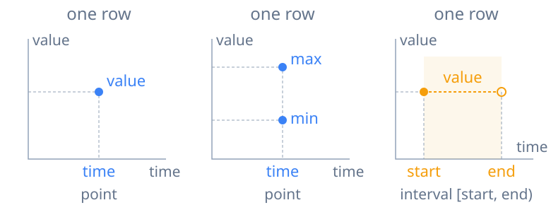

Equal times describe a point; different times describe the half-open interval from earliest to latest. Either can carry one or several values. Metadata does not define coordinates. See the [row types](/api/types#data-rows) for accepted inputs.

#### DataLoader and DataSource

A **DataLoader** acquires input and normalizes it into canonical rows, either as a complete snapshot or for a requested range. A DataSource uses those rows to answer queries, optionally aggregating them. Acquisition does not change how Charts select row fields.

The same drawing configuration can use a snapshot or a range loader. See [snapshot data](/guide/drawing-a-chart#snapshot-data) and [Chunk Loading](/guide/advanced/chunk-loading) for the two approaches.

### Series

A **Series** brings together data from a DataSource, a value Domain, and shared attributes such as its name and color. **Charts** and **Tooltips**, for example, are consumers of this information. Several Series can share a DataSource while using different Domains or presentation attributes.

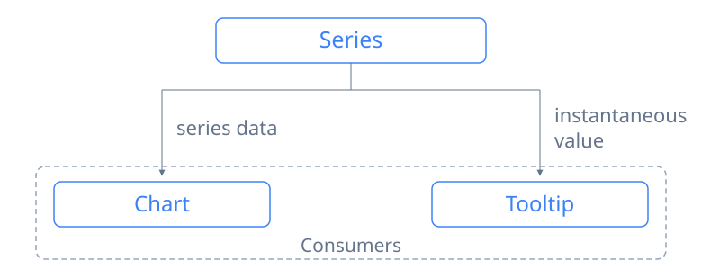

#### Instantaneous value

A Series also provides an **[instantaneous value](/api/types#instantaneous-values)** sampled at the time cursor. By default, it reads `value` from the latest row at or before the cursor, without interpolating drawn connections. Its sampling resolution can differ from the Chart's data resolution, allowing a Tooltip to show detailed values alongside a broader Chart view.

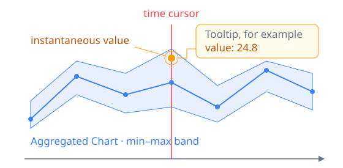

### Tracks

A **[Track](/api/types#timescopeoptionstracks)** provides a drawing region for Series consumers such as Charts and Tooltips. Tracks stack vertically, while Charts on the same Track are overlaid. All Tracks share time and display resolution, preserving temporal alignment across separate drawing regions.

Use Tracks to separate signals visually without losing their shared time reference. [Drawing a Chart](/guide/drawing-a-chart#multiple-tracks) shows a multi-Track configuration.

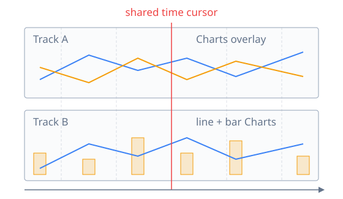

### Charts

A **Chart** visualizes the data of a Series using Marks and Links.

#### `using` selectors {#using-selectors}

A [`using` selector](/api/types#using) binds a primitive to the row's fields: a time supplies the horizontal coordinate and a value supplies the vertical coordinate. Different primitives can select different fields from the same row, without changing the row's time range.

Primitives take one or two coordinates, each defined by a time and a value. They can also refer to the Track's [shared baseline](#shared-baseline) (`#zero`) or its chart-area edges (`#top`, `#bottom`).

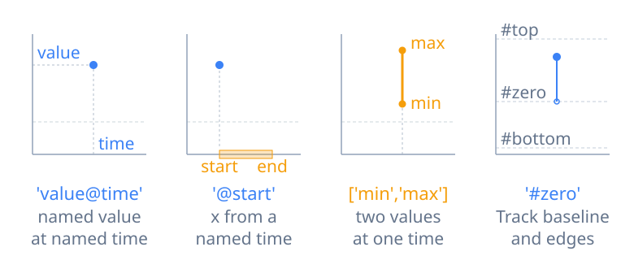

### Domains

A **[Domain](/api/types#timescopedomainoptions)** determines how values map to vertical positions through a scale and range. A value axis is an optional display of that mapping; a Domain works without one.

Each Series has its own Domain unless it shares one explicitly. Inline Domain settings belong to that Series, so auto-scaled Series can have different ranges even on the same Track. Equal heights need not mean equal values. Sharing a Domain gives Series a common scale and range, independently of their Track.

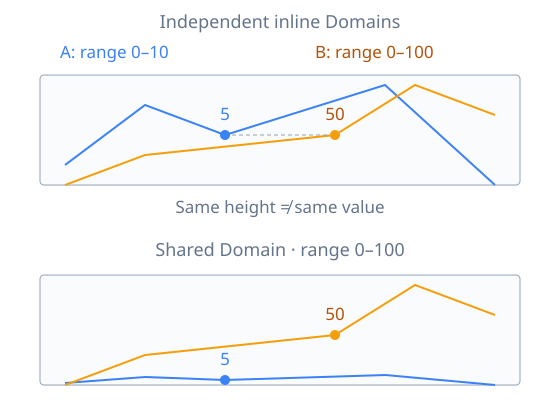

#### Shared baseline

Each Track has a **shared baseline** — the position where its time axis is drawn when enabled — referenced by `#zero`. Linear Domains that include zero align it there, even with different scales. Bars and areas can use this common reference without sharing a Domain.

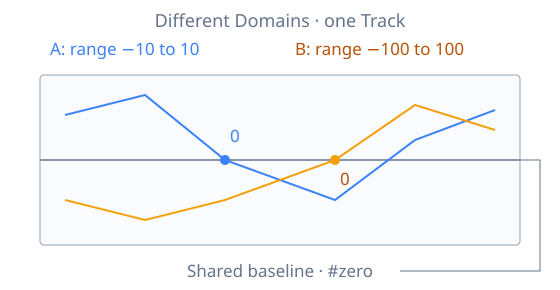

#### Floating ranges

A range away from zero can **float** above or below the shared baseline, magnifying local differences. A [**`floatingGap`**](/api/types#timescopedomainoptions) separates the range from the baseline; bars and areas extending to the baseline fade through it.

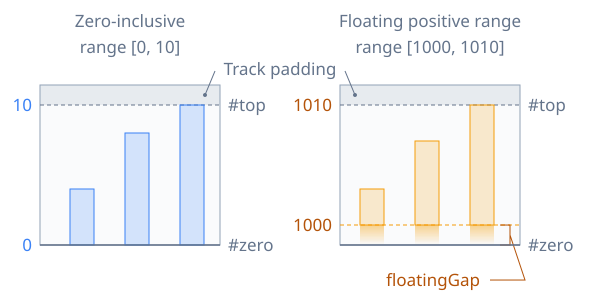

#### Auto scaling

A Domain can follow visible data. Unspecified bounds adjust automatically; [**`expand`** and **`shrink`**](/api/types#timescopedomainoptions) control whether the range can grow beyond specified bounds and contract again.

This lets you keep a useful reference range while accommodating larger values or inspecting a quiet portion of a signal. [Domain options](/api/types#timescopedomainoptions) describe the available bounds and policies.

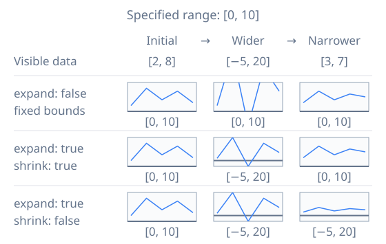

## Next steps

Follow [Drawing a Chart](/guide/drawing-a-chart) to turn these concepts into code, then explore more combinations in the [Examples](/examples/gallery).
