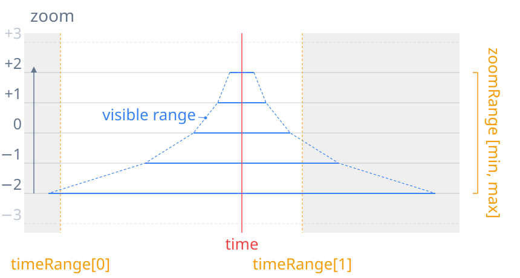
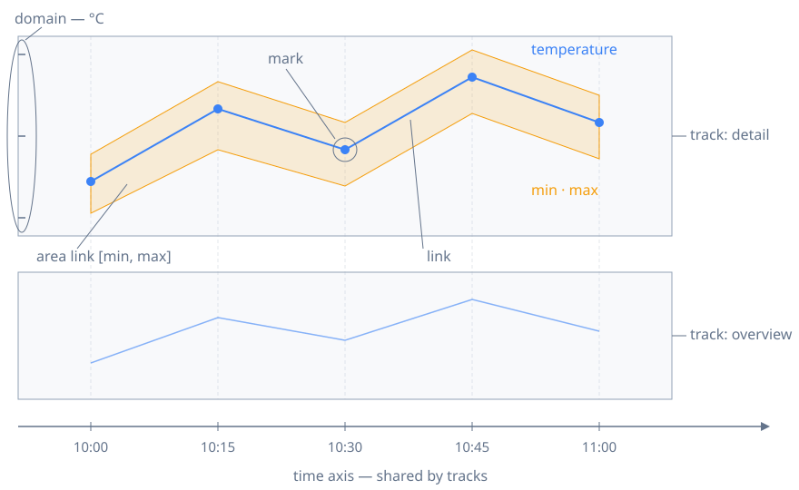
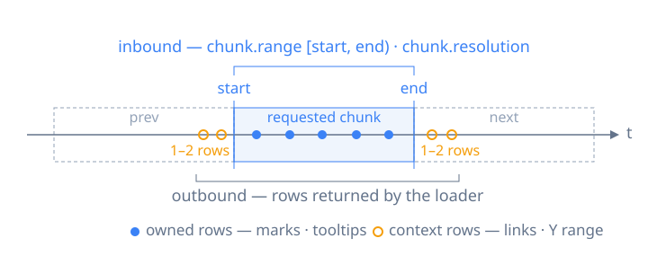
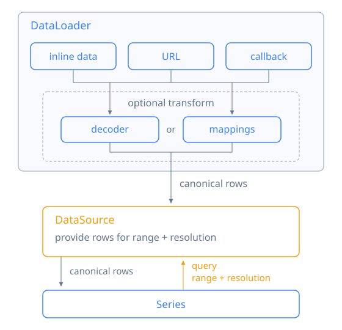

# Core Concepts

- The time axis supports **infinite**, **arbitrary-precision** navigation.
- Charts are composed of **marks** (per row) and **links** (between rows).
- Data is loaded in viewport-driven **chunks**.

See the [API reference](/api/timescope) for configuration details.

## Infinite time navigation

The time axis has no fixed precision or scale. By default, the past is unbounded and the future ends at the live clock. Set `timeRange: [undefined, undefined]` to navigate without bounds in either direction.

The view is centered on `time`, which follows the live clock when set to `null`. Numeric time uses seconds by default. Date and ISO string inputs are represented as Unix time. Increasing `zoom` by one halves the visible range and time per pixel; decreasing it by one doubles both.

`timeRange` / `zoomRange` optionally clamp the navigable range and zoom levels.

## Marks and links

A series' chart is not chosen as a whole; it is composed from two primitive families:

- **marks** — drawn per row: circle, bar, section, text, icon, path…
- **links** — drawn between rows: line, curve, step, or an area between two values…

Primitives pick their coordinates with `using` selectors such as `'value@time'`, `'@start'`, `['min', 'max']`, and `'#zero'`. See [Using Selectors](/api/timescope-options#using-selectors).

Tracks stack series vertically over a shared time axis. A domain is the value scale behind a Y axis, shared by every series that references it.

## Data sources

Inline arrays provide nonaggregated point and interval data. Use [`createDataSource({ type: 'point-aggregate', data })`](/api/timescope-options#source-types) for append-only point aggregation. URLs and loaders can provide either complete snapshots or requested ranges.

`decoder` converts loaded payloads to Timescope rows. `mappings` maps payload paths to named time and value fields. Point-aggregate sources provide fields such as `value#avg`, `value#min`, and `value#max`. Simple sources preserve point and interval rows without aggregation.

## Chunk loading

The timeline is tiled into chunks of `chunkSize` selected-resolution intervals. For each visible region, Timescope resolves the current time per pixel through the series' `data.resolution` option, then snaps it to a resolution available from the source. Zooming can therefore re-request the same region at a different source interval.

A range loader receives the requested `range` and `resolution`. Return rows at a density matching that resolution. Views share a ChunkStore that caches `source.query({ range, resolution })` results; direct Source queries bypass that cache and accept arbitrary ranges and resolutions. Call `source.invalidate([start, end])` when data changes, or `source.invalidate([latestDataTime, undefined])` to refresh the live tail.

Return rows overlapping the half-open range `[start, end)`. Points at `end` belong to the next chunk. For rows with multiple named times, the interval from the earliest to the latest time determines overlap; include a complete interval row in every chunk it overlaps.

For links, also return the nearest row on each side, or the two nearest on each side for curves. These neighboring rows are needed even when the requested range contains no points but a link crosses it. See [Chunk Loader](/api/timescope-options#chunk-loader) for the full response contract.

## Data pipeline

Sources provide rows with `time` or named `times`, `value` or named `values`, and optional `data` metadata:

- Built-in source configuration uses one of `data`, `url`, or `loader`.
- Snapshot acquisition supports point-aggregate and point-percentile sources.
- Chunked sources load visible ranges as needed — see [Chunk loading](#chunk-loading).
- `decoder` or `mappings` optionally transform payloads into canonical rows (mutually exclusive).

Series bind those rows to charts on tracks — see [Marks and links](#marks-and-links).

## Frame synchronization

`latchFrame()` groups time, zoom, and playback-time changes so they appear together. It is available after mounting and only one latch can be active at a time.

Call the setters after creating the latch, then call `commit()` to apply the grouped change. `commit()` returns a Promise. Call `abort()` to discard a pending change. Starting an incompatible operation may also abort the latch; use its `signal` or handle an `AbortError` when cancellation matters.
