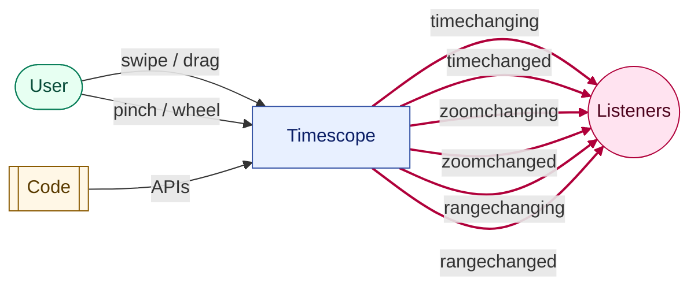

# Events

Timescope emits events when time, zoom, or selection range changes. Events are emitted for both user interactions and programmatic updates.

## Event Flow



## Timescope Events

| Event | When |
|-------|------|
| `timechanging` | During time change |
| `timechanged` | Time change complete |
| `zoomchanging` | During zoom change |
| `zoomchanged` | Zoom change complete |
| `rangechanging` | During selection resize |
| `rangechanged` | Selection update complete |

```typescript
import { Timescope } from 'timescope';

const timescope = new Timescope({
  target: '#timescope',
  style: { height: '160px' },
});

timescope.on('timechanged', (e) => {
  console.log('Time:', e.value?.toString() ?? 'now');
});

timescope.on('zoomchanged', (e) => {
  console.log('Zoom:', e.value.toString());
});

timescope.on('rangechanged', (e) => {
  const payload = e.value ? e.value.map((t) => t.toString()) : 'none';
  console.log('Selection:', payload);
});
```

## Cleanup

Event listeners return a cleanup function:

```typescript
const unsubscribe = timescope.on('timechanged', (e) => {
  console.log(e.value);
});

// Later
unsubscribe();
```

## See Also

- [API Reference](/api/timescope) for complete event signatures
- [Examples](/guide/examples/) for practical usage
